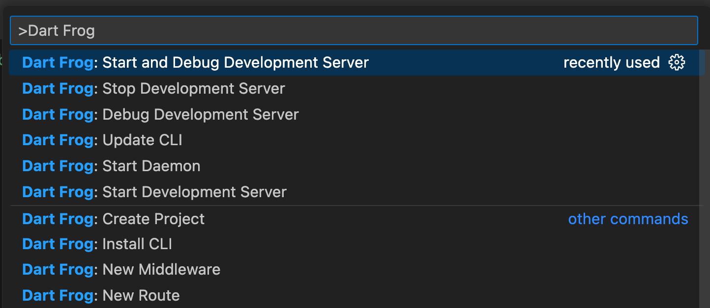
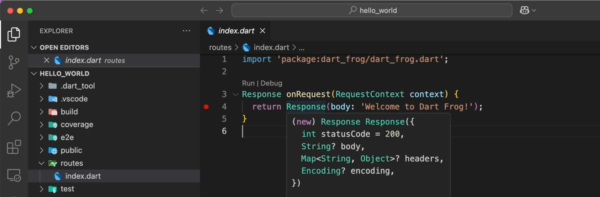

In some cases, you'll want to debug your Dart Frog app, and you might have noticed that by adding just the breakpoint, the debugger doesn't stop there like it does by default in a Flutter app.
Below, I'll show you two quick and easy options for debugging code in Dart Frog.

## Debugging with Dart Frog Plugin 🐸

:::caution
This plugin is only available for Visual Studio Code, if you are using another IDE, please check the second option.
:::

- Go to the Visual Studio Code Marketplace in [here](https://marketplace.visualstudio.com/items?itemName=VeryGoodVentures.dart-frog) and install the plugin.

:::info
You can also install the plugin by searching for `Dart Frog` in the extensions tab in Visual Studio Code.
:::

- Open your Dart Frog app.
- Open **Visual Studio Command Palette** by clicking `Shift` + `Command` + `P` (Mac) / `Ctrl` + `Shift` + `P` (Windows/Linux).
  You will see different options as shown in the image below.

- Click on the `Dart Frog: Start and Debug Development Server` option. This will start the Dart Frog server in debug mode.

:::note
You can also select the `Dart Frog: Debug Development Server` option if you already have the server running.
:::

- Add the breakpoints in your code and try to access the page where you added them. You will now see that the debugger stops at your breakpoints 🎉.

## Debugging by Attaching to Dart Process 🎯

- Open your Dart Frog application and run the server using the `dart_frog dev` command.
- In the terminal, you'll see something like `The Dart VM service is listening on http://127.0.0.1:8181/XXXXXXXXX/`. Copy the URL, as you'll need it in the next steps.
- Open the **Visual Studio Command Palette** and search for `Debug: Attach to Dart process`.
- Paste the URL you copied in the previous steps and press `Enter`. Now the debugger will stop at the breakpoints you added in your code 🎉.

