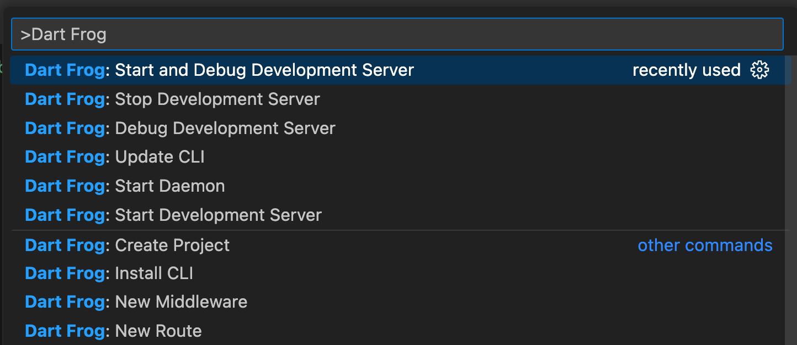
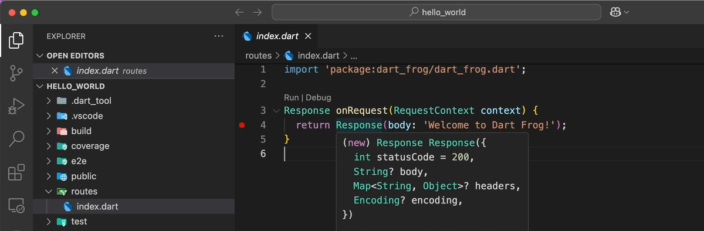

In some cases, you'll want to debug your Dart Frog app, and you might have noticed that by adding just the breakpoint, the debugger doesn't stop there like it does by default in a Flutter app.
Below, there are three quick and easy options for debugging code in Dart Frog.

## Debugging with Dart Frog IDE Extension 🐸

:::caution
This extension is currently only available for Visual Studio Code, if you are using another IDE, please refer to the [**Debugging by Attaching to Dart Process**](#debugging-by-attaching-to-dart-process-) section.
:::

:::info
If you are interested in an extension for Android Studio or OpenVSX there are some open issues you can follow to learn more about it:

- **Android Studio** [#1326](https://github.com/VeryGoodOpenSource/dart_frog/issues/1326)

- **OpenVSX** [#907](https://github.com/VeryGoodOpenSource/dart_frog/issues/907)

:::

1. Go to the Visual Studio Code Marketplace and [install the Dart Frog extension](https://marketplace.visualstudio.com/items?itemName=VeryGoodVentures.dart-frog). You can also install the extension by searching for `Dart Frog` in the [extensions tab in Visual Studio Code](https://code.visualstudio.com/docs/editor/extension-marketplace#_browse-for-extensions).
2. If you do not have the `Dart` extension installed, visit the [Dart extension page](https://marketplace.visualstudio.com/items?itemName=Dart-Code.dart-code) to install it. You can also install the extension by searching for `Dart` in the [extensions tab in Visual Studio Code](https://code.visualstudio.com/docs/editor/extension-marketplace#_browse-for-extensions).
3. Open your Dart Frog app within Visual Studio Code.
4. Open the [**Visual Studio Command Palette**](https://code.visualstudio.com/api/ux-guidelines/command-palette) by using `Shift` + `Command` + `P` (Mac) or `Ctrl` + `Shift` + `P` (Windows/Linux).

   

5. Click on the `Dart Frog: Start and Debug Development Server` option. This will start the Dart Frog server in debug mode.

:::info
You can also select the `Dart Frog: Debug Development Server` option if you already have the server running.
:::

6. Add the breakpoints in your code and try to access the endpoint where it gets hit. You will now see that the debugger stops at your breakpoints 🎉.

:::tip
Another way to run the server in debug mode using the `Dart Frog IDE Extension` is by using [Code Lens](https://code.visualstudio.com/blogs/2017/02/12/code-lens-roundup) in Visual Studio Code.

:::

## Debugging by Attaching to Dart Process 🎯

:::caution
To debug the `Dart Frog server` using this approach, you should have the [Dart extension](https://marketplace.visualstudio.com/items?itemName=Dart-Code.dart-code) installed in Visual Studio Code. If you are using another IDE, make sure you have [Dart installed](https://dart.dev/get-dart).
You can install the extension by searching for `Dart` in the [extensions tab in Visual Studio Code](https://code.visualstudio.com/docs/editor/extension-marketplace#_browse-for-extensions), or directly from the [Visual Studio Code marketplace](https://marketplace.visualstudio.com/items?itemName=Dart-Code.dart-code).
:::

1. Open your Dart Frog application and run the server using the `dart_frog dev` command.
2. In the terminal, you'll see something like `The Dart VM service is listening on http://127.0.0.1:8181/XXXXXXXXX/`. Copy the URL, as you'll need it in the next steps.
3. Open the [**Visual Studio Command Palette**](https://code.visualstudio.com/api/ux-guidelines/command-palette) by using `Shift` + `Command` + `P` (Mac) or `Ctrl` + `Shift` + `P` (Windows/Linux).
4. Paste the URL you copied in the previous steps and press `Enter`. Now the debugger will stop at the breakpoints you added in your code 🎉.

